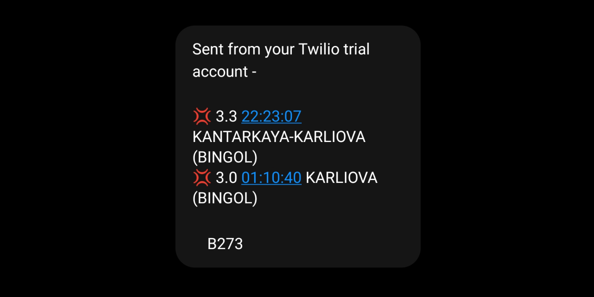

# Earthquakes Action

Earthquakes Action is Github Action that sends SMS when specified earthquakes happened.

## Screenshot



## Requirements

1. Twilio trial or upgraded account.
2. Public or private Github repo.

## Usage

1. Fork this repo.
2. If you have trial twilio account, you should specify [verified gsm numbers](https://www.twilio.com/console/phone-numbers/verified) for sending sms.
3. Go to your forked repo's "Settings" tab and navigate to "Secrets" from left sidebar.
4. Create secrets according to your [twilio account](https://www.twilio.com/console) information:

```bash
MSISDN_RECEIVERS_DELIMITED_WITH_SEMICOLON=+905311234567;+905531234567
MSISDN_SENDER=+10987654321
TWILIO_ACCOUNT_SID=AC123456ytfd3123456ytre12345612345
TWILIO_AUTH_TOKEN=7f123456ab56331cd245412312312356
# Criteria parameters
CITIES_DELIMITED_WITH_SEMICOLON=BINGOL;BALIKESIR # Or * character for all cities
MIN_MAGNITUDE=4.0
# for debugging purposes
ACTIONS_STEP_DEBUG=true
```

## Contributing

Pull requests are welcome. For major changes, please open an issue first to discuss what you would like to change.

Please make sure to update tests as appropriate.

## License

[MIT](https://choosealicense.com/licenses/mit/)